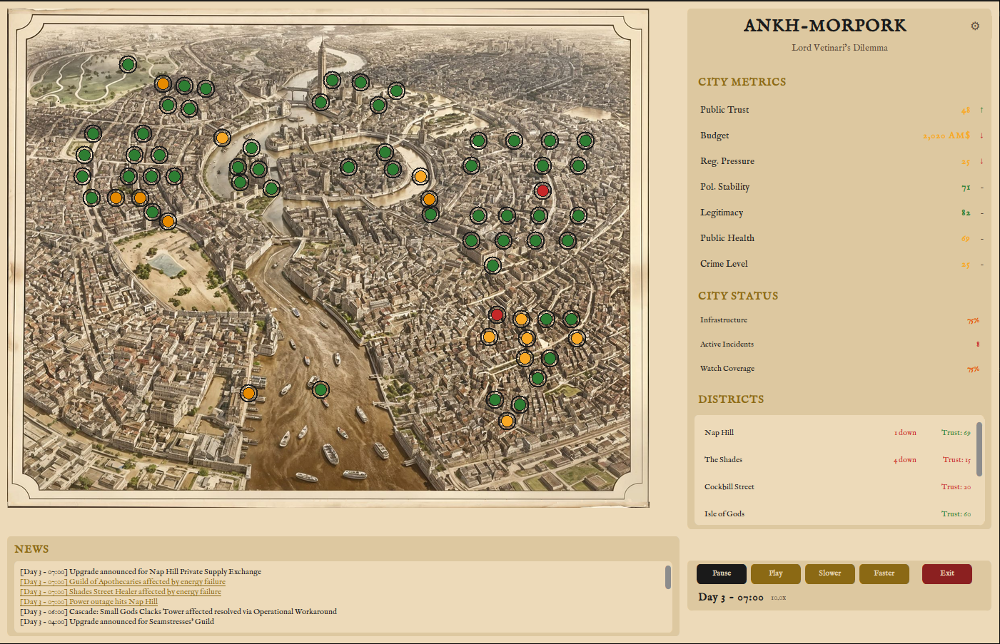

# Ankh-Morpork: Lord Vetinari's Dilemma



A crisis management simulation where you govern a city with interconnected infrastructure, competing interests, and no
easy answers.

Set in the fictional city of Ankh-Morpork, the simulation models how disruptions in digital and operational systems
translate into real-world consequences for cities, organisations, and the people who depend on them, without relying on
technical detail or domain-specific jargon.

The setting is fictional. The dynamics are not. See [why.md](why.md) for the
motivation, [docs/threatmodel.md](docs/threatmodel.md) for the design spec, and [docs/contract.md](docs/contract.md) for
what the simulator does and does not pretend to model.

## Purpose

The simulation is designed to support conversations and workshops around:

* The impact of digital and operational disruptions on:

    * public services
    * economic activity
    * trust and legitimacy
    * regulatory and political pressure
* Decision-making under uncertainty, time pressure, and budget constraints
* The cascading effects of infrastructure failures across sectors
* The relationship between operational choices and societal outcomes

Rather than focusing on how systems are built, the simulation focuses on what happens when they fail, degrade, or are
disrupted.

## Audience

This project is intended for use with:

* Executive leadership
* Board members
* Policy makers
* Regulators
* Public-sector decision-makers
* Mixed technical / non-technical groups in joint exercises

No prior technical or cybersecurity knowledge is required to participate.

## What the simulation does

Players take responsibility for a city with interconnected services, including:

* Energy
* Water and sanitation
* Communications
* Transport
* Public and private facilities
* Residential areas

Each building or district represents a concentration of services and dependencies rather than a single system.

Over time, the city experiences incidents, disruptions, and stressors inspired by real-world OT, ICS, and digital
infrastructure risks. These events affect:

* service availability
* economic output
* public sentiment
* institutional trust
* regulatory scrutiny

Players respond by allocating resources, prioritising interventions, and managing trade-offs between short-term
stability and long-term resilience.

## What the simulation is not

* It is not a technical training tool
* It does not simulate networks, protocols, or exploits
* It does not reward detailed technical knowledge
* It is not a competitive or leaderboard-based game

The emphasis is on outcomes, consequences, and choices, not on technical mechanisms.

## Why Ankh-Morpork?

Using a fictional city allows participants to:

* Engage seriously without referencing real-world sensitive locations
* Speak openly about failure, pressure, and trade-offs
* Recognise familiar patterns without defensive reactions

The city's exaggerated complexity and personality make interdependencies visible and memorable, while keeping
discussions grounded in reality.

## Installation

Requires Python 3.12 or later.

```bash
# Clone the repository
git clone git@github.com:ninabarzh/ankh-crisis-sim.git
cd ankh-crisis-sim

# Create and activate a virtual environment
python3 -m venv .venv
source .venv/bin/activate

# Install dependencies
pip install -e ".[dev]"
```

Dependencies are minimal: `customtkinter`, `Pillow`, and `pyyaml`.

## Usage

```bash
# Run the simulation
python -m src.main

# Run the test suite
pytest tests/ -v
```

On launch you see a brief introduction screen. Pressing Start enters the main game: a city map with building
indicators (green/yellow/amber/red), a metrics dashboard, a news ticker, and time controls. The simulation starts
paused.

- Play / Pause: control the flow of simulated time; the active button is highlighted (green = playing, dark = paused)
- Slower / Faster: change simulation speed (1x or 10x)
- Hover over a building lamp to see its name, district, and status
- Click a building with an active event to choose a remedy; remedies offered are filtered to those the threat model
  permits for that domain
- Click any metric in the dashboard for an explanation, including a list of emergency lenders when budget is tight
- Click a headline in the news ticker to read the full story
- Watch the news ticker for headlines as events unfold
- Monitor the dashboard for trust, budget, regulatory pressure, political stability, legitimacy, public health, and
  crime level
- Gear icon in the dashboard title bar opens game settings

The game ends when a loss condition triggers (trust collapse, revolt, bankruptcy, infrastructure failure,
assassination), when you survive your full term, or when you choose to resign or retire (retirement needs at least a
year served). There is no victory screen, only "You served your term. Here is what happened."

## Game settings

The gear button opens a settings panel that lets you adjust difficulty before or during play:

| Setting         | Options                   | Effect                                        |
|-----------------|---------------------------|-----------------------------------------------|
| Game duration   | Standard, Short, Extended | Term length in simulated years                |
| Event frequency | Normal, Rare, Frequent    | Multiplier on incident probability            |
| Discovery speed | Normal, Fast, Slow        | How quickly hidden failures surface           |
| Cascade risk    | Normal, Low, High         | Multiplier on failure propagation probability |

All settings are applied immediately and persist for the session.

## Configuring and customising

The entire simulation is data-driven. All game content lives in YAML files under `config/`. No Python changes are needed
for balancing, adding content, or creating scenarios.

### Districts

One file per district in `config/districts/`. Each defines wealth, density, infrastructure quality, political influence,
media attention, local trust, stressors, and narrative hooks.

```yaml
# config/districts/the_shades.yml
id: the_shades
name: "The Shades"
wealth: 12
density: 300
infrastructure_quality: 3.0    # 3x more likely to fail
political_influence: 0.2
media_attention_multiplier: 0.2
local_trust: 15
discovery_time_hours: [ 72, 120 ]
```

`infrastructure_quality` is a failure probability modifier: 1.0 = baseline, 3.0 = three times as likely to fail, 0.3 =
30% as likely.

To playtest with fewer districts, comment them out in `config/game.yml`:

```yaml
active_districts:
  - small_gods
  # - nap_hill         # disabled for testing
  # - the_shades
```

### Buildings

Building types are defined in `config/buildings/_types.yml` (shared behaviour: what they consume, produce, dependency
strengths, detection speed). Concrete buildings are placed in `config/buildings/instances.yml`:

```yaml
- id: mended_drum
  name: "The Mended Drum"
  type: tavern
  district: merchant_quarter
  position: [ 460, 280 ]
  status: operational
  narrative_hooks:
    - "Mended Drum brawl spills into street, breaks new fountain"
```

Add a building by appending to `instances.yml`. Add a new type by adding a key to `_types.yml`.

Current building types: `guild_hq`, `tavern`, `civic_amenity`, `slum_dwelling`, `middle_class_housing`,
`civic_institution`, `palace`, `water_source`, `power_source`, `clacks_tower`, `food_supply`, `brewery`, `transport`,
`communications_office`, `apothecary`, `healthcare`, `security`, `intelligence_service`, `tech_business`, `hackerspace`,
`workshop`, `fire_service`, `media`, `university`.

### Threats and events

Threat categories live in `config/threats/categories.yml`. The six systemic stressors are in
`config/threats/stressors.yml`: underinvestment, just-in-time logistics, vendor monoculture, social inequality,
organisational fragmentation, and narrative effects. Concrete event templates live in `config/threats/events.yml`:

```yaml
- id: tenement_subsidence
  name: "Tenement subsidence"
  category: degradation_and_neglect
  target_building_types: [ slum_dwelling ]
  target_districts: [ the_shades, cockbill_street ]
  domain: water
  residential_impact: true        # threatmodel "Residential" tag
  probability_base: 0.004
  stressor_amplifiers:
    underinvestment: 2.5
    social_inequality: 1.5
  impact:
    immediate:
      - metric: local_trust
        delta: -8
        scope: district
  headlines:
    - "Tenement walls crack in {district}; families evacuated"
```

The `residential_impact` flag is the threat model's "Residential Areas" row, layered over a utility domain (water,
energy, etc.). The narrative engine uses it to pick a louder headline and the remedy filter uses it to drop pathways the
threat model does not allow for residential events (no accountability).

### Remedies

All seven remedy types are defined in `config/remedies.yml`. Four are the named threat-model recovery pathways (
`technical_restoration`, `resilience_investment`, `public_compensation`, `accountability_actions`) and carry
`valid_domains` lists; three are universal meta-options (`press_statement`, `operational_workaround`, `do_nothing`). The
GUI offers only the pathways the threat model permits for each event's domain, plus all three meta-options.

Any remedy with a `contradicts_penalty` in its `trust_effect` is treated as a narrative-window remedy: it stays in
RESPONDING for `duration_hours`, then either follows up with substantive action or fires the penalty. Press statement is
the only such remedy today; future ones plug in with no code change.

### Detection

Discovery times per district and building type, detection mechanisms (Watch patrols, citizen complaints, Vimes
intuition, media investigation), and player investments to improve detection are in `config/detection.yml`.

### Narratives

`config/narratives/headlines.yml` holds simple one-line templates (always visible). `config/narratives/stories.yml`
holds richer expandable stories with tone markers. Both support `{district}`, `{building}`, `{duration}`, and other
template variables.

### End conditions

Loss conditions, term completion, the early-retirement gate, and post-game reflection questions live in
`config/end_conditions.yml`. Resignation and early retirement are player-initiated through `Simulation.resign()` and
`Simulation.retire()`; all other end states fire automatically from metric or district thresholds.

### Emergency borrowing

Lenders are declared in `config/game.yml` under `budget.emergency_borrowing`. Each carries an availability flag, a
maximum amount, a regulatory pressure cost, and a political stability cost. The GUI surfaces this from the Budget info
popup when you click the Budget metric.

### Quick reference

| I want to...                          | Edit this file                                       |
|---------------------------------------|------------------------------------------------------|
| Tweak a district's wealth or trust    | `config/districts/<name>.yml`                        |
| Add a new building                    | `config/buildings/instances.yml`                     |
| Change remedy costs or valid domains  | `config/remedies.yml`                                |
| Add a new event type                  | `config/threats/events.yml`                          |
| Adjust stressor effects or increments | `config/threats/stressors.yml`                       |
| Adjust how fast failures are noticed  | `config/detection.yml`                               |
| Change starting budget or trust       | `config/game.yml`                                    |
| Reconfigure emergency lenders         | `config/game.yml` under `budget.emergency_borrowing` |
| Write new headlines                   | `config/narratives/headlines.yml`                    |
| Change loss thresholds                | `config/end_conditions.yml`                          |
| Playtest with fewer districts         | `config/game.yml` `active_districts`                 |

## Technology

* Python 3.12
* CustomTkinter and Pillow (GUI)
* PyYAML (config loading)
* Python dataclasses (typed models, no Pydantic required)
* Engine fully decoupled from GUI and testable without a display

## Documentation

* [why.md](why.md): why this repo exists, in the author's voice
* [docs/threatmodel.md](docs/threatmodel.md): the design spec the code is built to satisfy
* [docs/contract.md](docs/contract.md): what the simulator models and what it refuses to

## Status

Under active development. 200-plus engine and GUI tests covering remedy filtering, narrative-effects accumulation,
residential events, emergency borrowing, player end actions, and the full passive-dynamics loop. Run
`.venv/bin/python -m pytest tests/ -v` to see the suite. Current focus is on balancing, playtesting, and expanding event
variety.

## License and usage

This project is licensed under the [Polyform Noncommercial Licence](LICENCE).

You are welcome to use this software for:

- Learning and personal experimentation
- Academic research, coursework, and dissertations
- Classroom and curriculum use by educators
- Non-commercial workshops, civic exercises, and community events
- Game design research and serious games scholarship

Additional permissions for academic and educational research are set out
in [RESEARCH-EXCEPTION.md](RESEARCH-EXCEPTION.md).

You may not use this software for:

- Paid workshops or training courses
- Commercial product development or integration
- Any context where money changes hands

A [commercial licence](COMMERCIAL-LICENCE.md) is required to use this project in paid or commercial contexts. All
proceeds from commercial licences, beyond the costs of maintaining this project, will be donated to Alzheimer's
organisations in memory of [Terry Pratchett](https://terrypratchett.com/).

This project is actively developed and maintained. The licence ensures that:

- The simulation remains freely accessible for education and research
- Commercial use contributes to something worthwhile
- Exploitation without contribution is not an option

If you are unsure whether your use case is commercial, ask. [Ambiguity is solvable](https://tymyrddin.dev/contact/);
silence is not.
